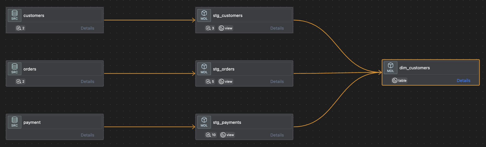

# DBT Fundamentals Project

This project is built following the [dbt Fundamentals Course](https://learn.getdbt.com/courses/dbt-fundamentals), demonstrating core dbt concepts with the Jaffle Shop data using Snowflake as the data warehouse.

## Installation

1. Create and activate virtual environment:
```bash
python -m venv dbt-venv
source dbt-venv/bin/activate
```

2. Install requirements from parent directory:
```bash
pip install -r requirements.txt
```

## Project Structure
```
dbt-fundamentals/
├── models/
│   ├── staging/          
│   │   ├── stripe/
│   │   │   ├── stg_payments.sql
│   │   │   └── schema.yml
│   │   └── jaffle_shop/
│   │       ├── stg_customers.sql
│   │       ├── stg_orders.sql
│   │       └── schema.yml
│   └── marts/
│       └── dim_customers.sql
├── tests/
└── dbt_project.yml
```

## Model Lineage



## Running the Project

1. Set up your Snowflake credentials in `~/.dbt/profiles.yml`

2. Execute models:
```bash
dbt run
dbt test
```

## Key Learnings from dbt Fundamentals Course

- Sources and staging models
- Model materialization strategies
- Testing and documentation
- dbt Core functionality
- Project organization
- Model dependencies and refs

## Testing & Documentation

Run tests:
```bash
dbt test
```

Generate docs:
```bash
dbt docs generate
dbt docs serve
```

## Resources

- [dbt Fundamentals Course](https://learn.getdbt.com/courses/dbt-fundamentals)
- [dbt Documentation](https://docs.getdbt.com/docs/introduction)